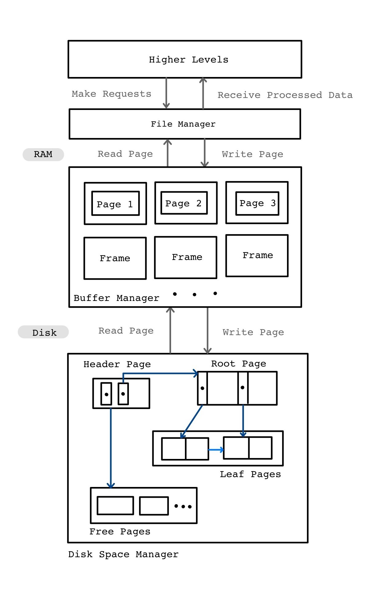
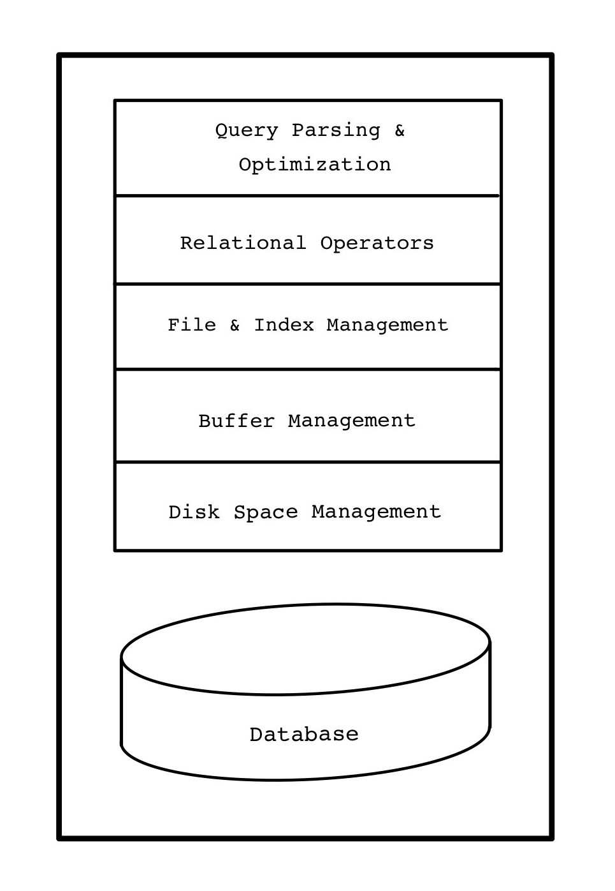
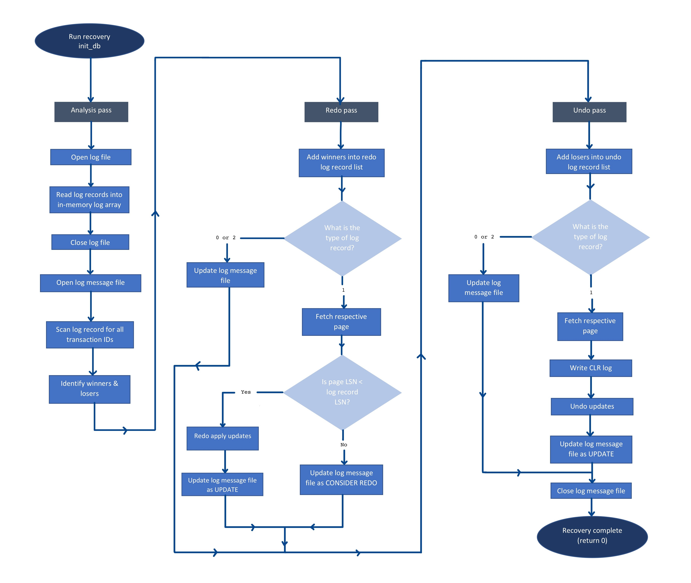

# **Database Systems**

## **Projects**

- Project 1: SQL Practice
- Project 2: Disk-based B+ Tree
- Project 3: Buffer Management
- Project 4: Lock Table
- Project 5: Concurrency Control
- Project 6: Transaction Logging & Three-Pass Recovery
 

### **Note:**
All codes in Projects 2~6 are implemented in **Linux Ubuntu 20.04** environment.

 

## **Project Summary: Disk-based B+ Tree (Implementation in C)**
 

### **Overall Layered Architecture**

A simple database is implemented as an on-disk B+ tree to efficiently store, read and modify data. This implementation is designed as a -layered architecture, where each layer abstracts the layer below. Each
layer of this multi-layered architecture has a designated role and responsibility within the system.

The diagram below shows the layered architecture pattern of the database system.

 

**Disk Space Management Layer**

This layer is the bottom most layer of the database system. The disk space manager, as its name suggests,
manages space on disk. The roles of the disk manager include:
- Mapping pages to on-disk locations
- Loading pages from disk to memory
- Saving pages back to disk & ensuring writes

Higher levels call upon the disk management layer to read or write a page and allocate or de-allocate logical pages. The disk manager supports the concept of a page as a unit of data where fixed-length records are stored in a B+ tree. The B+ tree is made up of header page, free page, leaf page and root page data structures.

 

**Buffer Management Layer**

This layer is situated below the index management layer and the disk management layer. The buffer management layer exists for efficiency since it speeds up data processing and reduces the number of disk accesses. The roles of the in-memory buffer manager include:
- Reading/Mapping disk pages into main memory
- Handling dirty pages and page eviction
- Making calls to the disk manager to perform database APIs on disk pages (file I/O)

The buffer manager manages available memory with a buffer pool, which is a collection of page-sized
buffer frames.

 

**Index Management Layer**

This layer provides the abstraction of records to higher levels of the database system. The index manager maintains a clustered index with an in-memory B+ tree. The B+ tree search structure is a balanced tree in which the internal nodes direct the search (with keys) and the leaf nodes contains data entries (records).

The index layer receives requests to perform operations on records (i.e., insert, delete, find, update) and issues instructions to disk space manager to allocate or deallocate space on disk.

 

**Relational Operators Layer**

This layer receives queries from the query parser and returns processed data. It receives in-memory data from the index manager and processes them according to the appropriate relational operators.

 

**Query Parsing & Optimization Layer**

This layer process users’ inputs received from command prompt and parses the queries. It passes the processed queries to the layer below and fetches requested data for users.

 

**Relationship between Layers**

The following diagram illustrates the relationship between the layers of the database architecture.

 

### **Concurrency Control Implementation**

Concurrency control is important to manage simultaneous operations without conflicting with each other. It allows multiple database transactions that require access to the same data to execute concurrently without violating data integrity. Concurrency control is implemented on the bottom three layers of this database system: disk space management layer, buffer management layer and index management layer.

In this database, a lock-based protocol is used to  implement concurrency control. All transactions are unable to perform read or write operations until it acquires an appropriate lock on the target data set. Lock requests are made to the lock manager.

A **strict two-phase locking (Strict 2PL)** mechanism is used in this protocol using shared/exclusive locks. This mechanism abides the following 2 rules:
1. If a transaction wants to read (respectively, modify) an object, it first requests a shared
(respectively, exclusive) lock on the object.
2. All **exclusive locks** held by a transaction are to be released until after the transaction commits.

Deadlock detection and recovery is also implemented in this database system for concurrency control. Deadlocks are detected through wait-for graphs and allocations will be rolled back to get the program into their previous safe states.

In this database, the **transaction manager** handles all transactions. It synchronizes the concurrent access of database transactions to shared objects in the system. A transaction can be seen by the database system as a list of actions, which includes reads and writes of database objects.

To implement the locking protocol, the lock manager, transaction manager and buffer manager are each protected a respective global mutex object, namely lock manager latch, transaction manager latch and buffer manager latch.

 

**Lock Manager & Transaction Manager Implementation**

To allow concurrent execution of transactions without breaching data integrity, a lock manager and transaction manager is implemented to support the following principles:
- Conflict-serializable schedule for transactions
- Record-level locking with shared/exclusive locks
- Deadlock detection
- Abort and rollback

The lock manager maintains the following data structures to enforce a locking protocol on the system.
- Lock objects (for lock table, implemented as a hash table)
- Linked list (to implement a wait-for graph)

The transaction manager maintains a transaction table (a queue) to keep track of all ongoing transactions. It also uses the following data structures:
- Action objects (update/read)
- Transaction objects

 

**Call Path of Database APIs**

When the program receives command from user input to execute database transactions (i.e., find and update APIs), the system calls `trx_begin` function to allocate and initialize a new transaction structure. A transaction ID will be assigned and a **shared lock** is given by default. The transaction manager will then add this transaction to the transaction table.

Then, the program calls the appropriate function according to user inputs.
- Searching a key: The program calls `db_find` function.
- Updating a key: The program calls `db_update` function.

The index manager will search for the given key in the in-memory B+ tree and retrieve the respective record value. If record is found, the program calls `add_to_trx_arr` function. The transaction manager retrieves the target transaction from the transaction table. Then the program requests for a lock from the lock manager by calling `lock_acquire` function.

- Searching a key: A **shared** lock is acquired since the transaction is in read-only mode.
- Updating a key: An **exclusive** lock is acquired since data might be modified by the transaction.

After acquiring respective locks, the program performs the appropriate operation according to user inputs.
- Searching a key: The index manager returns record value of given key.
- Updating a key: The index manager updates in-memory record value of given key with new userinput value.

In retrieving records, when buffer manager receives requests from index manager to perform operations on target pages, transactions need to acquire buffer manager latch and page latch on target page. The buffer manager maintains page latches on each page, so the pages are protected when multiple transactions tries to access them. The locks will be released after the transaction completes its operation.

**Deadlock detection** is carried out by the lock manager. A wait-for graph is used to check for deadlocks. If a deadlock (cycle in wait-for graph) is detected, the transaction manager aborts said transaction by performing **rollback** action. Updates performed on target transaction will be undone to return to previous safe state.

When the transaction completes, the system calls `trx_commit` function to clean up the transaction. The acquired locks on target transaction will be released by the lock manager by calling `lock_release` function. Due to **Strict 2PL** policy, all locks are held until the commit point and released all at once.

 

### **Crash-Recovery Implementation**

In this database, **ARIES** (Algorithm for Recovery and Isolation Exploiting Semantics) recovery algorithm is implemented to ensure two important properties of transactions: *atomicity* and *durability*. This **recovery manager** ensures atomicity by undoing the actions of transactions that do not commit and durability by making sure all actions of committed transactions survive system crashes. Transaction logging and crash recovery are implemented on the bottom three layers of this database system: disk space management layer, buffer management layer and index management layer.

ARIES recovery algorithm adheres to three main principles:
1. **Write Ahead Logging** (WAL): Any change to a database object is first recorded in the log. The log record must be written to stable storage before the change to database object is written to disk.
2. **Repeating History During Redo**: On restart following crash, the database is to be returned to the state it was before system crash. ARIES undoes the actions of transactions still active at the time of the crash.
3. **Logging Changes During Undo**: Changes made to the database whole undoing a transaction are logged to make sure that such action is not repeated in the event of repeated restarts (caused by failures).

ARIES further supports a **Steal/No Force** policy in the buffer manager and concurrency control protocols that involve record-level locking (fine granularity locking). The concept of Steal policy is that modified pages may be written out to disk at any time. The concept of No Force policy is that updates of a transaction are not to be forced to disk before the transaction commits.

When the recovery manager is invoked after a crash, ARIES algorithm performs three passes:
1. **Analysis pass**: This phase scans the log from the most recent checkpoint record to the end of the log. It determines:
    - The starting point of the Redo phase by keeping track of dirty pages.
    - The list of transactions to be rolled back in the Undo phase by monitoring the state of
transactions.
2. **Redo pass**: ARIES repeats history. Operations in log are reapplied to restore the database to its state as of the time of the system failure.
3. **Undo pass**: Updates of uncommitted (loser) transactions are reverted in reverse chronological order.

 

**Transaction Logging & Recovery Implementation: Data Structure**

The log component of the recovery manager stores the information needed to undo updates performed by a transaction in case it has to be rolled back. It also stores information needed to re-apply updates of committed transactionsto the database in case they are lost due to system crash. The log component also keeps tracks of all relevant state transitions such as begin, update, commit, rollback and compensate.

The log component is implemented by log record and log buffer data structure. Each log record is assigned a unique log sequence number (LSN). ARIES requires that LSNs are allocated in monotonically increasing order. An in-memory log buffer is used by buffer manager to maintain log records before periodically force written to stable storage.

For recovery purposes, each page in the database contains the LSN of the most recent log record that describes the update to the page. This page LSN is used to determine whether recovery is to be done to that page.

The following tables contain important recovery related information:
- A transaction table is maintained by the transaction manager to keep track of the last LSN for each transaction thread, which is the LSN of the most recent log record of said transaction.
- A dirty page table is maintained by the buffer manager to keep track of the dirty pages in the buffer pool. Each entry contains the LSN of the first log record that caused the respective page to be dirty. This LSN identifies the earliest log record that might have to be redone for the page in the event of a crash.

 

**Write-Ahead Log Protocol Implementation**

WAL is the fundamental rule that ensures that a log record of every change to the database is available during crash recovery. If a transaction made a change and committed, the no-force approach means that some of these changes may not have been written to disk at the time of a crash.

To adhere to this protocol, a log record is to be written for each of the following actions:
- *Begin*: When a new transaction is initialized, a BEGIN type record is appended to end of the inmemory log buffer (log tail). The LSN of this transaction will be added to the transaction table.
- *Updating a page*: After modifying a record of a given key, an UPDATE type record is added to the log tail. The page LSN is then set to the LSN of the update log record.
- *Commit*: When a transaction is committed, a COMMIT type log record containing the transaction ID is force-written. That is, the log record is appended to end of the log tail before being forced written to disk by the disk manager, even if no-force approach is being used. This is accomplished by forcing all log records up to and including the one with LSN equal to the pageLSN to stable storage before writing the page to disk. The transaction is considered to have committed the instant that its commit log is written to stable storage.
- *Rollback*: When a transaction is aborted, a ROLLBACK type log record containing the transaction ID is appended to the log. During ARIES recovery, the Undo pass will be executed on this transaction.
- *Undoing an update*: When a transaction is rolled back (because it is aborted or due to system crash), the recovery manager will undo updates or writes that are done on this transaction. When the action described by an UPDATE log record is to be undone, a **compensation log record** (CLR) is written.

 

**Checkpointing in ARIES**

Checkpoints are taken periodically to reduce the workload of the recovery manager during restart in the event of system crash. This is done by saving the last LSN to stable storage every time the recovery manager writes the log records in the in-memory buffer to disk. Every time the system restarts, the recovery manager will retrieve the most recent last LSN from disk when initializing in-memory log buffer. With this fuzzy checkpointing strategy, the time taken to recover from a crash will be significantly shorter since it limits the number of logs to be scanned on recovery.

 

**Call Path for Three Pass Recovery Algorithm**

The diagram below shows a flowchart of the call path of three-pass recovery.

The three-pass recovery algorithm is executed when the program calls `init_db` function.

The recovery manager performs the first pass: **analysis pass**.
- When the system crashes and restarts, only the part of the log that was flushed to the disk remains. Thus, the recovery manager re-establishes knowledge of state at the most recent checkpoint via transaction table and dirty page table stored at the checkpoint.
- The recovery manager identifies **winners** (complete transactions) and **losers** (incomplete transactions) by scanning log records for every transaction ID. Each transaction that has been processed are added to an array of transaction IDs. If the processed transaction is a complete transaction (log records contain BEGIN and COMMIT types), it is added into winners’ array. Else, the transaction is added into losers’ array.
- Winners and losers are printed in the log message file. Analysis pass ends.

The recovery manager performs the second pass: **redo pass**.
- The recovery manager loops through each winner’s transaction ID in the winners’ array and adds them to a newly-allocated redo log record list. The redo list is processed in chronological order.
- If the log record is of type 0 (BEGIN), the log message file is updated with LSN and transaction ID.
- If the log record is of type 1 (UPDATE), the respective page is fetched from disk. A log record’s
update will be redone (**redo apply**) if the page’s LSN is less than the log record’s LSN. The log message file is updated. The recovery manager reupdates log record. Else, the log record will be printed as consider redo in log message file.
- If the log record is of type 2 (COMMIT), the log message file is updated with LSN and transaction ID.
- Redo pass ends when all log records in the redo list are processed.

The recovery manager performs the third pass: **undo pass**.
- The recovery manager loops through each loser’s transaction ID in the losers’ array and adds them to a newly-allocated undo log record list. The undo list is processed in reverse chronological order, which is possible with the usage of prevLSNs.
- If the log record is of type 0 (BEGIN), the log message file is updated with LSN and transaction ID.
- If the log record is of type 1 (UPDATE), the respective page is fetched from disk. Compensation log record (CLR) is written and the log record’s update will be undone (undo update). The log message file is updated with and the log record is printed as update. The recovery manager undoes updates of log record.
- If the log record is of type 2 (COMMIT), the log message file is updated with LSN and transaction ID.
- Undo pass ends when all log records in the undo list are processed.

Recovery is complete.
