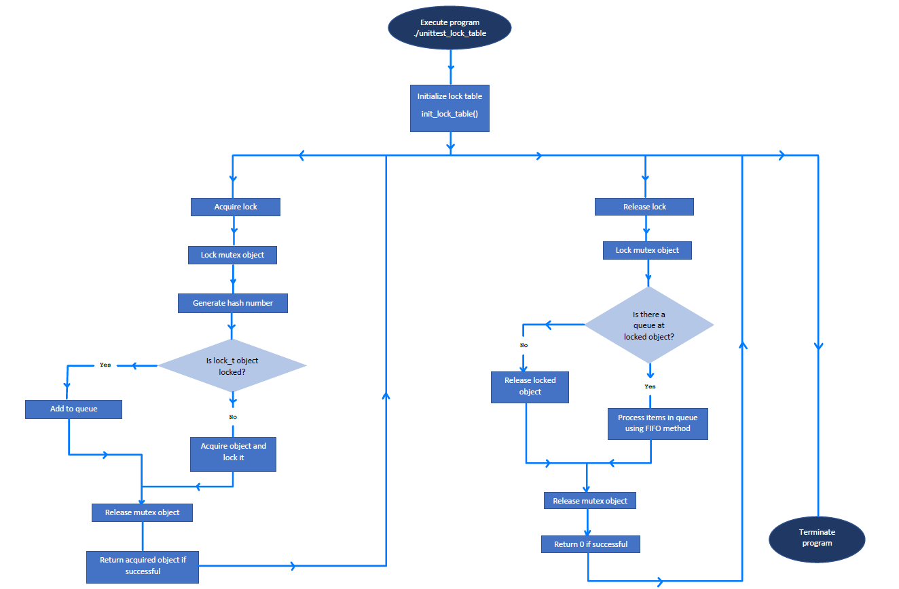

# **Project 4: Lock Table**

A DBMS typically uses a locking protocol as a means of concurrency control. This is to ensure that only serializable, recoverable schedules are allowed and that no actions of committed transactions are lost while undoing aborted transactions. Multiple transactions may request a lock on a data item at the same time, thus a lock table is needed to manage locking requests made by transactions.
<br/><br/>
The implemented locking protocol follows the following criteria:
*	Mutual exclusion: only one thread in critical section at a time
*	Deadlock-free progress
*	Bounded wait: must eventually allow each waiting thread to enter
*	Each thread waits for same amount of time

<br/>**Data Structure used in Locking Protocol**

The locking protocol is implemented using two data structures: a queue and a lock table.

The data structure of queue is as shown below:
```c
typedef struct queue_t {
	int qid;
	int table_id;
	int64_t key;
	struct queue_t *next;
} queue_t;
```

The data structure of lock table is as shown below:
```c
typedef struct lock_t {
	int id;
	int locked;
	int qlen;
	struct queue_t * q;
} lock_t;
```

The lock table is implemented as a hash table, where the table IDs and record IDs (key) are used to generate a unique hashing index. Each *lock_t* item has a queue associated to it. Every node in the queue represents the transaction which requested for lock. The queue links lock objects of multiple threads. Every new lock request for the data item will be added at the end of queue as a new node. The queue follows **First In First Out** order (FIFO).

<br/>

### **Compilation Method**

A Makefile is provided for compiling convenience. To compile, the following input is entered at command prompt:

    make

<br/>

### **Call Path for Lock Table APIs**

The flowchart diagram below shows the workflow of the lock table implementation.
<br/><br/>

<br/><br/>
First, **init_lock_table()** is called to initialize the data structures required for implementing lock table (i.e. lock latch and hash table). 
*	Lock table latch is a mutex object of type *pthread_mutex_t* and is initialized using **pthread_mutex_init()** function.
*	A hash table array of size HSIZE is initialized. The array objects are of type *lock_t*.
*	If successful, return 0. Return 1 if error occurred.

Then, multiple threads are created, each acquiring and releasing record locks by calling **lock_acquire()** and **lock_release()**. The respective table ID and record value (key) are passed to said functions as arguments.

**lock_acquire()**
*	Lock the mutex object *lock_table_latch*; if the mutex is already locked, the calling thread will be blocked until the mutex becomes available.
*	A hash number is generated using the given table ID and key.
*	If the *lock_t* object of hash table is locked, it is added to a queue through **add_to_queue()** function.
  	  * If there is no queue, a new queue is created.
	  * If there is an existing queue, traverse to the end of queue and add the new node to the end of queue.
*	If it is unlocked, acquire the object and lock it.
*	Release the mutex object *lock_table_latch*.
*	If successful, return the acquired object. Else, return 0.

**lock_release()**
*	Lock the mutex object *lock_table_latch*; if the mutex is already locked, the calling thread will be blocked until the mutex becomes available.
*	If there is no queue at the locked object, release it.
*	Else, process the items in the queue through **process_queue()** function. The queue is processed using First In First Out (FIFO) method. The first item in the queue will be processed and removed from the queue. Then, the locked object will be released.
*	Release the mutex object *lock_table_latch*.
*	If successful, return 0.