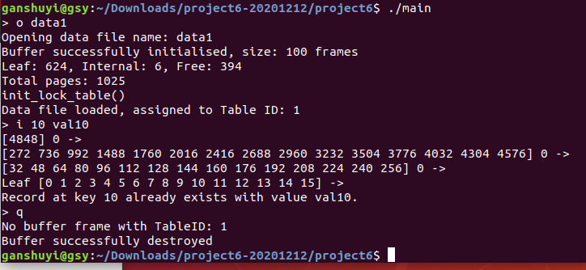
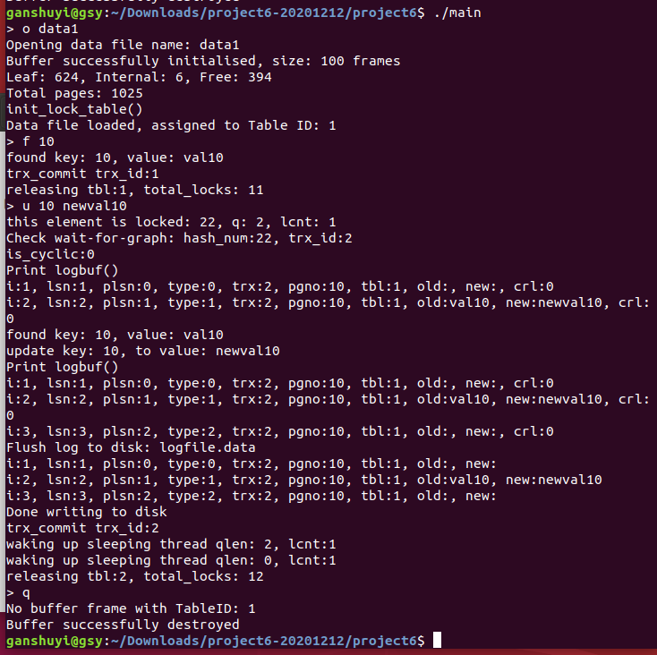
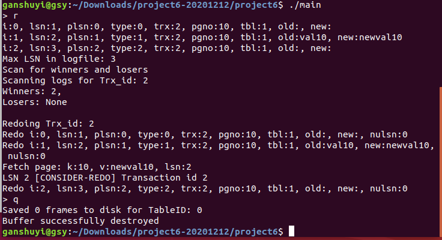
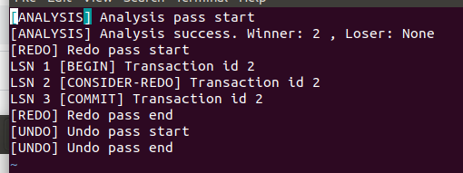

# **Project 6: Transaction Logging & Three-Pass Recovery**

Modifications are made onto the previous on-disk B+ tree implementation to support database transaction logging and recovery. In this database, **ARIES** (Algorithm for Recovery and Isolation Exploiting Semantics) recovery algorithm is implemented to ensure the atomicity and durability properties of the DBMS. This algorithm is based on the **WAL** (Write Ahead Logging) protocol.
<br/><br/>
The failure scenario that is considered in this implementation is when the system restarts or crashes. In this case, all in-memory data is lost, and in-progress transactions need to be rolled back to their previous safe state. Committed transactions need to be reapplied.
<br/><br/>
ARIES algorithm performs 3 passes:
1.	**Analysis pass**: This phase reads the last checkpoint record in the log to figure out active transactions and dirty pages at the point of crash/restart.
2.	**Redo pass**: Operations in log are reapplied to restore the database to its state as of the time of the system failure.
3.	**Undo pass**: Updates of uncommitted (loser) transactions are reverted in reverse chronological order. <br/><br/>

**Log Manager Implementation: Data Structure**
<br/><br/>
To support database transaction logging and recovery, the data structures of a log record, an in-memory log buffer and a log record page is maintained. Also, the header page data structure is modified by adding a page LSN.
<br/><br/>
ARIES maintains a log file which is a sequence of log records to record the process of transactions and their actions which cause changes to recoverable data objects. Each log record *log_t* contains:
*	A unique log sequence number (LSN) – 8 bytes
*	Previous log ID – 8 bytes
*	Transaction ID 
*	Log type: BEGIN (0), UPDATE (1), COMMIT (2), ROLLBACK (3), COMPENSATE (4) 
*	Table ID
*	Page number – 8 bytes
*	Offset
*	Data length
*	Old image (char value)– 120 bytes
*	New image (char value) – 120 bytes
*	Next undo LSN (next undo point for compensate log only)

The data structure is as follows.
```c
typedef struct log_t { 
    pagenum_t lsn; 
    pagenum_t plsn; 
    int trx_id; 
    int type;
    int table_id; 
    pagenum_t pagenum; 
    int offset; 
    int data_len;
    char old_image[120]; 
    char new_image[120];
    pagenum_t next_undo_lsn; 
} log_t;
```

A linked list data structure is used to implement log buffer in memory. Each *logbuffer_t* node holds a log record and a pointer to the next node. The data structure is as follows.
```
typedef struct logbuffer_t { 
    log_t log; //log record
    struct logbuffer_t * next;
} logbuffer_t;
```

A linked list data structure is used to implement log record page. Each *page_lrec* node holds its LSN, key, record value and a pointer to the next node. The data structure is as follows.
```
typedef struct page_lrec {
	pagenum_t lsn; //8 bytes
	pagenum_t key; //8 bytes
	char value[120]; //120 bytes
	struct page_lrec * next;
} page_lrec;
```
<br/>

### **Compilation Method**

A Makefile is provided for compiling convenience. To compile, the following input is entered at command prompt:

    make

<br/>

### **Call Path for Three Pass Recovery Algorithm**

The diagram below shows a flowchart of the call path of three-pass recovery.


 
The three-pass recovery algorithm is executed when the program calls `init_db` function.
<br/><br/>
The program performs the first pass: **log analysis**.
<br/>
*  The log file is opened for reading. If the log file does not exist, the function returns 0. 
The log records in the log file are read into an in-memory log array. The file is closed after reading.
*  A log message file is opened for appending log messages. The program identifies **winners** (complete transactions) and **losers** (incomplete transactions) by scanning log records for every transaction ID. Each transaction that has been processed are added to an array of transaction IDs. If the processed transaction is a complete transaction (log records contain BEGIN and COMMIT types), it is added into winners’ array. Else, the transaction is added into losers’ array.
*  Winners and losers are printed in the log message file. Analysis pass ends.

The program performs the second pass: **redo pass**.
<br/>
*  The program loops through each winner’s transaction ID in the winners’ array and adds them to a newly-allocated redo log record list. The redo list is processed in chronological order.
If the log record is of type 0 (BEGIN), the log message file is updated with LSN and transaction ID.
*  If the log record is of type 1 (UPDATE), the program fetches the respective page by calling `fetch_page`. A log record’s update will be redone (**redo apply**) if the page’s LSN is less than the log record’s LSN. The log message file is updated and the log record is printed as update. The program reupdates log record by calling `sv_page`. Else, the log record will be printed as consider redo in log message file.
*  If the log record is of type 2 (COMMIT), the log message file is updated with LSN and transaction ID.
*  Redo pass ends when all log records in the redo list are processed.

The program performs the third pass: **undo pass**.
<br/>
*  The program loops through each loser’s transaction ID in the losers’ array and adds them to a newly-allocated undo log record list. The undo list is processed in reverse chronological order.
*  If the log record is of type 0 (BEGIN), the log message file is updated with LSN and transaction ID. 
*  If the log record is of type 1 (UPDATE), the program fetches the respective page by calling `fetch_page`. CLR (Compensation Log Record) is written and the log record’s update will be undone (**undo update**). The log message file is updated with and the log record is printed as update. The program undo updates of log record by calling `sv_page`.
*  If the log record is of type 2 (COMMIT), the log message file is updated with LSN and transaction ID.
*  Undo pass ends when all log records in the undo list are processed.

The log message file is closed after writing and `init_db` function returns 0. Recovery is completed.

<br/>

### **ARIES-based Recovery: Summary of Program Workflow**

The diagram below shows the flowchart of this program. <br/>


This is a summary of the workflow of the on-disk B+ tree which supports **ARIES recovery**.
<br/><br/>
The program is executed with the following input at command prompt:
```
./main
```
If the log manager is not initialized yet, `init_log` is called. The last LSN is read from disk by calling `update_master_lsn`. An array of active transactions is initialized to keep track of the last sequence number for each transaction thread. An array of buffer frames with size 1000 is initialized.
<br/><br/>
The program will then prompt for user’s input.
<br/><br/>
**Opening a datafile**
```
o data1
```
The program will open a datafile with a filename specified by user (e.g. *data1*). It first initializes buffer of default size 100. Then it assigns a unique table ID to the datafile. The program then initializes the data structures required to implement a lock manager.
<br/><br/>
**Inserting a key**
```
i 10 val10
```
The program inserts key 10 with value *val10* into the in-memory B+ tree. Then the program calls `sv_page` to write log record to file. Even if program terminates, the key and its assigned value can still be retrieved since it is written to disk.
<br/><br/>
**Finding a key**
```
f 10
```
The search operation calls `trx_begin` to initialize new transaction before searching for given key. If record is found, the program calls `add_to_trx_arr`. to A **shared lock** is requested since it only reads the record value. The program cleans up the transaction by calling `trx_commit`.
<br/><br/>
**Updating a key**
```
u 10 newval10
```
The update operation calls `trx_begin` to initialize new transaction. The program adds this transaction to in-memory log buffer with log type 0 (BEGIN). A new log record is allocated and initialized. The LSN of this transaction is added to the array of active transactions. A new log buffer record is initialized. The log buffer record is added to in-memory log buffer if the log buffer is empty. Else, the log buffer is traversed until the end before adding the new log buffer record.
<br/><br/>
The program calls `db_update`, where the program searches for record value with given key. If found, the program calls `add_to_trx_arr`. An **exclusive lock** is requested since write action will be executed. Original value and new value is stored in case rollback action needs to be performed.
<br/><br/>
The program adds this transaction to in-memory log buffer with log type 1 (UPDATE).
If key is found, the record value will be updated to the latest value given by user. The program calls `sv_page` to write log record to file. Then the program adds the LSN and key to log record page queue by calling `add_to_pg_lsn`. A new node of log record page is allocated. If the queue is empty, the node is assigned to be head of queue. Else, the queue is traversed to the end. If it is an existing key in the queue, only the LSN is updated. Else, the new node is added to the end of the queue.
<br/><br/>
The function `db_update` returns 0 if key is successfully updated.
<br/><br/>
The program adds this transaction to in-memory log buffer with log type 2 (COMMIT). Then the program writes log buffer to disk by calling `flush_log`. All log buffer record in log buffer queue is written to a log file. The last LSN is updated to disk by calling `update_master_lsn`. The program frees the in-memory log buffer.
<br/><br/>
The program calls `trx_commit` to clean up the transaction.
<br/><br/>
**Running recovery**
```
r
```
The program calls `init_db` to run three-pass recovery: **log analysis**, **redo**, and **undo**.
<br/><br/>
**Aborting a transaction/Rollback**
```
a 10
```
The program calls `trx_abort` to rollback updates made on given key (e.g. 10).
<br/><br/>
The program searches for transaction record with given key (transaction ID). If target transaction record is found, the locks in the linked lists of actions are released one at a time. The program goes through all actions in the linked list. Only updates or writes that are done on the target transaction is undone. The program adds the transaction to in-memory log buffer with log type 3 (ROLLBACK). The program searches for given key and changes the record value back to its original value. Then, the program writes the log record to file by calling `sv_page`. When rollback is done, the program adds the transaction to in-memory log buffer with log type 4 (COMPENSATE) and moves on to the next action object on the linked list. 
<br/><br/>
When all rollbacks are completed, the program calls `flush_log` to write log buffer into disk.
<br/><br/>
If user inputs `q` as command, all data stored in the buffer frames will be written to disk if the frame is dirty. The buffer frames will then be reset and freed. The in-memory tree will be destroyed, followed by the allocated buffer. The program will then be terminated.

<br/>

### **ARIES-based Recovery: Sample Test Output**

This is a rundown of how disk-based B+ tree program is executed.
<br/><br/>
Datafile *data1* (provided in project6 folder) is used as sample input file for this program.
<br/><br/>
The following image shows the output of the 1st execution.
<br/>


<br/>
User inputs `./main` at command prompt. Then it receives user input.
<br/><br/>
After command `o data1` is entered, the program opens and processes said datafile. The following commands are inputted to insert new values into the database.
```
i 10 val10
```
Command `q` is entered, and the program proceeds to termination.
<br/><br/>
The following image shows the output of the 2nd execution.
<br/>


<br/>
User inputs `./main` at command prompt again.
Command `f 10` returns the key and its value (*val10*) is printed. This shows that the key and value are written to *data1* file.
<br/><br/>
Command `u 10 newval10` is entered, to update key 10. Command `f 10` is entered again, and the program returns the key and its updated value (*newval10*).
<br/><br/>
Command `q` is entered, and the program proceeds to termination.
<br/><br/>
The following image shows the output of the 3rd execution.
<br/>


<br/>
User inputs `./main` at command prompt again.
<br/><br/>
Command `r` is entered to run recovery. There are **2 winners** (completed transactions). The following image shows the log message file after recovery is completed.
<br/>


<br/>
Command `q` is entered, and the program proceeds to termination.